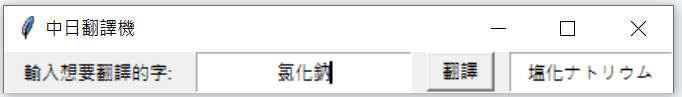

# **Ingredient translator**

## 功能

* 輸入食品原料的中文/日文，按下翻譯即可顯示翻譯

## 使用

* python
* json
* tkinter
* pyperclip
* pyinstaller

## 目前收錄字庫

    TW_JP_dict = {
        '高果糖糖漿':'果糖ブドウ糖液糖',
        '菊糖':'イヌリン',
        '異麥芽寡糖':'イソモルトオリゴ糖',
        '葡萄糖':'グルコース',
        '氯化鈉':'塩化ナトリウム',
        '葡萄柚濃縮果汁':'グレープフルーツ濃縮果汁',
        '檸檬酸':'クエン酸',
        '檸檬酸鈉':'クエン酸ナトリウム',
        '蘋果酸':'リンゴ酸',
        '氯化鉀':'塩化カリウム',
        '氯化鎂':'塩化マグネシウム',
        '乳酸鈣':'乳酸カルシウム',
        '葡萄糖酸內酯':'グルコノラクトン',
        '麩酸鈉':'グルタミン酸ナトリウム',
        '碳酸鎂':'炭酸マグネシウム',
        '胺基酸':'アミノ酸'
    }

---

## 2019/7/31 新增、改進功能

* 新增

    1. 自動判斷輸入的語言，因此將兩個按鈕合併為一個 (中翻日、日翻中 -> 翻譯)

    2. 按下翻譯後，會同時複製至剪貼簿，方便使用者貼到其他工作文件上

    3. 利用 pyinstaller 打包成執行檔

* 改進

    1. 利用 dictionary value 去抓出對應的 key，解決了輸入日文無法翻譯成中文的問題

---
